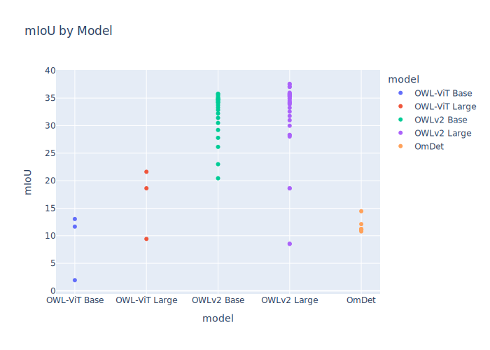

# Find The Food

## Overview

This project is an empirical analysis of zero-shot object detection models for food segmentation, benchmarked on the FoodSeg103 dataset. We discovered that a Top-K approach outperforms traditional threshold-based methods, as it reduces reliance on confidence scores by assigning each pixel to the most common class label among the top K detections. This method improves performance significantly up to K values in the 20s and 30s, making the exact choice of K less critical. Our experiments also revealed that different models behave differently under various thresholds, with OWLv2 emerging as the best performer for zero-shot food segmentation tasks.

## Table of Contents

1. [Introduction](#introduction)
2. [Installation](#installation)
3. [Dataset](#dataset)
4. [Usage](#usage)
    - [Inference](#inference)
    - [Metrics Calculation](#metrics-calculation)
    - [Data Visualization](#data-visualization)
5. [Key Features](#key-features)
6. [Methodology](#methodology)
7. [Models Evaluated](#models-evaluated)
8. [Metrics](#metrics)
9. [Requirements](#requirements)
10. [Results](#results)
11. [References](#references)

## Introduction

Semantic segmentation of food items in images is a challenging task due to the high variability and overlapping nature of food items. This project explores the use of zero-shot object detection models combined with advanced segmentation techniques to perform food segmentation without any additional model training. The full [paper](/Find_The_Food.pdf) goes more in depth with the processes and experiments.

## Installation

1. **Clone the Repository**
 
   ```bash
   git clone https://github.com/cesarades/FindTheFood.git
   cd FindTheFood
   ```
 
2. **Create and Activate Conda Environment**
 
   ```bash
   conda env create -f environment.yml
   conda activate findthefood
   ```

   This will install all required packages as specified in the `environment.yml` file.

## Dataset

We tested our framework on the [FoodSeg103 dataset](https://xiongweiwu.github.io/foodseg103.html). The test set is already included in this repository.

1. **FoodSeg103**
   ```
   FindTheFood 
   └── data
       └── (your dataset)
       └── FoodSeg103
           └── Images
               ├── ann_dir   # Ground truth masks
               │   ├── 00000001.png
               │   └── ...
               ├── img_dir   # RGB images
               │   ├── 00000001.jpg
               │   └── ...
               └── inf_dir   # Outputs (will be generated)
   ```

   - **ann_dir**: Contains the ground truth masks.
   - **img_dir**: Contains the RGB images.
   - **inf_dir**: Will contain the outputs from the models.

2. **Custom Dataset**

   To test on another dataset, ensure that it follows the same directory structure as above. 

## Usage

### Inference

Run the inference script to generate segmentation masks:

```bash
python inference.py --model <model_index> --threshold <value> --nms <value> --polygon_refin <True/False> --topk <value> --dataset <dataset_name>
```

**Model Index:**

0. google/owlv2-base-patch16-ensemble
1. google/owlv2-large-patch14-ensemble
2. google/owlvit-base-patch32
3. google/owlvit-large-patch14
4. omlab/omdet-turbo-swin-tiny-hf
5. IDEA-Research/grounding-dino-tiny
6. IDEA-Research/grounding-dino-base

**Default Values:**

- `--model`: 0
- `--threshold`: 0.0
- `--nms`: 0.3
- `--polygon_refin`: True
- `--topk`: None
- `--dataset`: FoodSeg103

**Parameters:**

- `--model`: Model index (0-6 inclusive).
- `--threshold`: Confidence threshold for detections.
- `--nms`: Non-Maximum Suppression threshold.
- `--polygon_refin`: Whether to use polygon refinement (True/False).
- `--topk`: Number of top detections to consider.
- `--dataset`: Name of the dataset.

**Example:**

To run inference using model 2 with default parameters on the FoodSeg103 dataset:

```bash
python inference.py --model 2 --dataset FoodSeg103
```

### Metrics Calculation

Metrics are automatically calculated after inference and stored in `stored_metrics.csv`. If you would like to recalculate metrics for all or a subset of models run:


```bash
python data_analysis.py --model <model_index> --threshold <value> --nms <value> --polygon_refin <True/False> --topk <value> --dataset <dataset_name>
```

**Example:**

To calculate metrics on all the infered models, run:

```bash
python data_analysis.py 
```

### Data Visualization

Visualize the data and results:

```bash
python data_visualization.py
```

## Key Features

- **Zero-Shot Object Detection**: Utilizes pre-trained models without fine-tuning.
- **Mask Combination Method**: Combines segmentation masks based on the most frequent food per pixel, resolving ties with the highest confidence detection.
- **Polygon Refinement**: Enhances segmentation masks with polygon refinement for better accuracy.
- **Benchmarking**: Evaluated on the FoodSeg103 dataset.

## Methodology

The proposed method involves the following steps:

1. **Object Detection**: Use an out-of-the-box zero-shot object detection model to detect food items in images.
2. **Segmentation**: Pass the resulting bounding boxes to the Segment Anything Model (SAM) to obtain segmentation masks.
3. **Polygon Refinement**: Refine the segmentation masks using polygon-based methods.
4. **Mask Combination**: Combine all segmentation masks using the proposed method.


## Models Evaluated

The object detection models tested in this study include:

- **OWL-ViT**: Base and Large versions.
- **OWLv2**: Base and Large versions.
- **OmDet**

Initial tests were conducted with Grounding DINO (base and tiny), but this model class was not well suited for this project specific framework.

## Metrics

The models were assessed based on the following metrics:

- **mIoU**: Mean Intersection over Union over each class.
- **mACC**: Mean accuracy over all classes.
- **aAcc**: Overall pixel accuracy.

## Requirements

- **Operating System**: Linux
- **GPU**: CUDA-compatible GPU
- **Python Version**: Python 3.7 or higher
- **Package Manager**: Conda


## Results

In this section, we present the performance of our proposed method using various models and parameters. The evaluation metrics used are Mean Intersection over Union (mIoU), Mean Accuracy (mACC), and overall pixel accuracy (aAcc). The results are visualized in several plots to illustrate the trends and conclusions drawn from our experiments.

### 1. Performance Comparison Across Models

#### Mean Intersection over Union (mIoU) by Model

We evaluated several models, including OWLv2 Base, OWLv2 Large, OWL-ViT Base, OWL-ViT Large, and OmDet. The mIoU scores for each model are presented in the figure below.



**Observations:**

- **OWLv2 Base** and **OWLv2 Large** significantly outperformed the other models, achieving mIoU values up to **40%**.
- **OWL-ViT Base** and **OWL-ViT Large** showed lower performance, with mIoU values mostly below **20%**.
- **OmDet** exhibited moderate performance, with mIoU values around **15%**.
- These results highlight the effectiveness of OWLv2 models in handling food segmentation tasks.

---

### 2. Effect of Thresholding on Model Performance

#### mIoU by Model with Thresholding

We analyzed the impact of applying different confidence thresholds on the models.


**Observations:**

- **OWLv2 Base** and **OWLv2 Large** achieved the highest mIoU values (~**35%**) when using threshold-based filtering.
- **OWL-ViT Base** and **OWL-ViT Large** performed poorly under thresholding, with mIoU values below **10%**.
- **OmDet** had moderate performance, with mIoU around **15%**.
- Thresholding improved the performance of OWLv2 models, confirming their robustness under confidence-based filtering.

---

### 3. Effect of Top-K Selection on Model Performance

#### mIoU by Model with Top-K Selection

We evaluated the models using Top-K selection, where only the top K detections are considered.


**Observations:**

- **OWLv2 Base** and **OWLv2 Large** maintained high performance, with mIoU values peaking above **25%**.
- **OWL-ViT Base** and **OWL-ViT Large** remained significantly lower, with mIoU values below **20%**.
- **OmDet** showed moderate results but was outperformed by OWLv2 models.
- The Top-K approach reinforced the robustness and adaptability of OWLv2 models.

---

### 4. Impact of Non-Maximum Suppression (NMS) on OmDet

#### OmDet NMS Metrics

We analyzed how varying the NMS threshold affects the performance of the OmDet model.


**Observations:**

- Increasing the NMS threshold from **0.1** to **0.4** improved mIoU, mACC, and aAcc, with **mACC** showing the largest gain.
- Beyond an NMS threshold of **0.4**, performance gains plateaued, indicating diminishing returns.
- Optimizing the NMS threshold is beneficial for OmDet, but the effect levels off after a certain point.

---

### 5. OWLv2 Base Model: Top-K Analysis

#### OWLv2 Base Top-K Metrics

We explored how varying the Top-K parameter affects the OWLv2 Base model's performance.


**Observations:**

- Increasing **K** improved mIoU and mACC, with gains leveling off beyond **K=30**.
- Overall pixel accuracy (aAcc) remained relatively stable across different K values.
- The optimal performance for OWLv2 Base is achieved at higher K values, indicating the effectiveness of considering more detections.

---

### 6. Polygon Refinement in OWLv2 Large Model

#### OWLv2 Large Polygon Refinement Metrics

We assessed the impact of polygon refinement on the OWLv2 Large model.


**Observations:**

- Polygon refinement provided marginal changes.
- Performance declined significantly beyond a threshold of **0.4**, emphasizing the importance of appropriate threshold selection.

---

### 7. Threshold Sensitivity in OWLv2 Large Model

#### OWLv2 Large Threshold Metrics

We investigated how different confidence thresholds affect the OWLv2 Large model.


**Observations:**

- mIoU and mACC peaked within the **0.2–0.4** threshold range and dropped sharply beyond **0.5**.
- Overall pixel accuracy (aAcc) showed minimal variation, indicating stable pixel-level performance.
- Selecting an optimal threshold is crucial for maximizing the OWLv2 Large model's performance.

---

### 8. OWLv2 Large Model: Top-K Analysis

#### OWLv2 Large Top-K Metrics

We analyzed the effect of varying the Top-K parameter on the OWLv2 Large model.


**Observations:**

- mIoU and mACC improved steadily as **K** increased, peaking around **K=30**, beyond which gains plateaued.
- aAcc showed a slight decline with higher K values, possibly due to including less accurate detections.
- Balancing the Top-K value is essential to achieve optimal performance without compromising accuracy.

---

### Overall Conclusions

- **OWLv2 Models**: Both Base and Large versions consistently outperformed other models in food segmentation tasks, demonstrating their robustness and effectiveness.
- **Threshold and Top-K Tuning**: Careful selection of confidence thresholds and Top-K values is crucial for optimizing model performance. In most scenarios, Top-K out performs thresholds.
- **Model Recommendation**: OWLv2 models are recommended for zero-shot food segmentation tasks due to their superior performance.


## References
- [Hugging Face](https://huggingface.co/models?pipeline_tag=zero-shot-object-detection&sort=downloads)
- [Segment Anything Model (SAM)](https://arxiv.org/abs/2308.05938)
- [OWL-ViT](https://arxiv.org/abs/2205.06230)
- [OWLv2](https://arxiv.org/abs/2306.09683)
- [OmDet](https://arxiv.org/abs/2403.06892)
- [FoodSeg103 Dataset](https://arxiv.org/abs/2105.05409)
